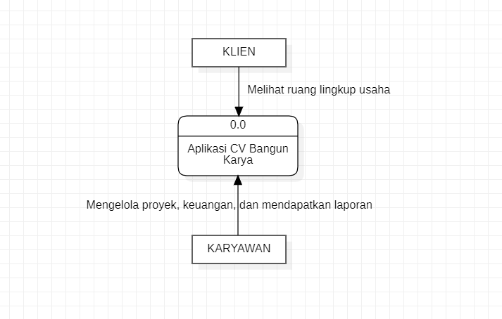

# PPL-B
FP

Anggota Kelompok:
- **M Afif Fadhlurrahman** 05111840000093
- **Rafi Nizar Abiyyi** 05111840000094
- **Abdur Rohman** 05111840000100

## Data Flow Diagram

level 0:


level 1:


level 2:


## Builder

Class diagram:


Main.java
```java
public class Main {

    public static void main(String[] args) {
        

        ReportBuilder reportBuilder = new ReportBuilder();

        Report laporanKaryawan = reportBuilder.buatLaporanKaryawan();

        laporanKaryawan.daftarIsi();

        Report laporanKeuangan = reportBuilder.buatLaporanKeuangan();

        laporanKeuangan.daftarIsi();

    }

}
```

ReportBuilder.java
```java
public class ReportBuilder {

    public Report buatLaporanKaryawan() {

        Report laporan = new Report();

        laporan.addKonten("data karyawan");
        laporan.addKonten("data gaji");
        laporan.addKonten("data kinerja");

        System.out.println("Laporan karyawan berhasil dibuat");

        return laporan;
    };
    
    public Report buatLaporanKeuangan() {

        Report laporan = new Report();

        laporan.addKonten("data pemasukan");
        laporan.addKonten("data pengeluaran");

        System.out.println("Laporan keuangan berhasil dibuat");

        return laporan;
    }
}
```

Report.java
```java
import java.util.ArrayList;
import java.util.List;

public class Report{

    private List<String> konten = new ArrayList<String>();
    private String bulan;
    private String tahun;

    public void addKonten(String konten_tambah) {
        konten.add(konten_tambah);
    }

    public void daftarIsi() {
        for (String isiKonten : konten) {
            System.out.println(isiKonten);
        }
        System.out.print("\n");
    }
}
```

## Facade

Class diagram:


Main.java
```java
import java.util.*;

public class Main {

    public static void main(String[] args) {

        MaterialPrice matAPI = new MaterialPrice();

        System.out.println(matAPI.getItemList("balok kayu", "100"));
    }

}
```

MaterialPrice.java
```java
import java.util.HashMap;

public class MaterialPrice{

    private MaterialAPI matAPI = new MaterialAPI();
    private HTTPRequest httpRequest = new HTTPRequest("Mozilla/5.0");
    
    public String getItemList(String item, String outputSize) {
        HashMap <String, String> params = matAPI.retrieveItemsParams(item, outputSize);

        String respond = httpRequest.sendGET(params);

        return respond;
    }
}
```

MaterialAPI.java
```java
import java.util.HashMap;

public class MaterialAPI {

    private String oauth;
    private String host;

    public MaterialAPI () {
        this.oauth = "API-KEY";
        this.host = "twelve-data1.p.rapidapi.com";
    }

    public MaterialAPI(String APIkey) {
        this.oauth = APIkey;
        this.host = "twelve-data1.p.rapidapi.com";
    }

    public HashMap retrieveItemsParams(String item, String outputSize) {
        HashMap<String, String> params = new HashMap<String, String>();
        params.put("API-KEY", this.oauth);
        params.put("HOST_URL", this.host);
        params.put("output_size", outputSize);
        params.put("item_name", item);
        params.put("type", "json");

        return params;
    }
}
```

HTTPRequest.java
```java
import java.util.*;

public class HTTPRequest {

    private static String USER_AGENT;

    public HTTPRequest(String UA) {
        this.USER_AGENT = UA;
    }

    public String sendGET(HashMap params) {
        System.out.println("masuk sendGET");
        System.out.println("Isi params:");
        
        params.forEach((k, v) -> System.out.println(k + ": " + v));

        // respond dalam bentuk JSON Object dan JSON Array
        String respond = "Hasil respond dari API";
        return respond;
    }

    public String sendPOST(HashMap params) {
        System.out.print("masuk sendPOST");
        System.out.println("Isi params:");
        
        params.forEach((k, v) -> System.out.println(k + ": " + v));

        // respond dalam bentuk JSON Object dan JSON Array
        String respond = "Hasil respond dari API";
        return respond;
    }
}
```